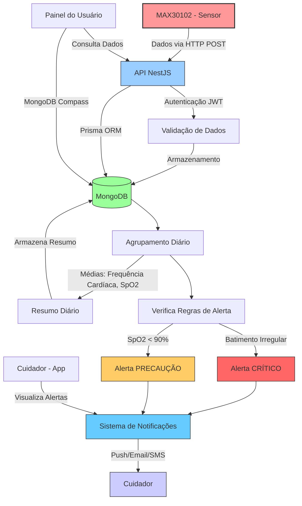

# VitalSync - Documentação da API

## 🏥 Monitoramento Inteligente do Sono para Prevenção de AVC em Idosos

Esta é a documentação da API do **VitalSync**, um sistema inovador que monitora padrões de sono e sinais vitais em pacientes idosos. Usando inteligência artificial, a API processa e armazena dados biométricos para prever riscos de AVC.

---

## 🌟 Funcionalidades

### **Funcionalidade Principal**
- Monitoramento biométrico em tempo real (frequência cardíaca, oxigênio no sangue, VFC)
- Sistema inteligente de alertas para cuidadores
- Rastreamento abrangente de dados de saúde
- Autenticação segura de usuários (JWT)

### **Destaques Técnicos**
- Endpoints RESTful bem documentados
- Validação e transformação de dados
- Resumos diários automáticos
- Geração de dados fictícios para desenvolvimento

---

## 🛠 Stack Tecnológica

### **Backend**
| Tecnologia | Finalidade |
|------------|------------|
| NestJS | Framework da API |
| MongoDB | Banco de dados NoSQL |
| Prisma | ORM para MongoDB |
| Swagger | Documentação da API |
| JWT | Autenticação |

### **Ferramentas de Desenvolvimento**
| Ferramenta | Uso |
|-----------|-----|
| class-validator | Validação de requisições |
| class-transformer | Serialização de dados |
| bcrypt | Criptografia de senhas |
| config | Gerenciamento de ambiente |

---

## 🚀 Primeiros Passos

### **Pré-requisitos**
- Node.js v16+
- MongoDB (Atlas ou local)
- Python 3.8+ (para scripts de dados fictícios)

### **Instalação**
```bash
# Clonar o repositório
git clone https://github.com/jaobarreto/Vitalsync.git
cd vitalsync/api-vitalsync

# Instalar dependências
npm install

# Configurar ambiente
cp .env.example .env
# Configure suas credenciais do banco de dados

# Gerar cliente Prisma
npx prisma generate

# Rodar em modo de desenvolvimento
npm run start:dev
```

### **Configuração do Banco de Dados**
1. Crie um cluster no MongoDB
2. Atualize a string de conexão no `.env`

---

## 📚 Documentação da API

### **Endpoints Disponíveis**

#### 🔐 Autenticação
| Método | Endpoint | Descrição | Códigos de Status |
|--------|----------|-----------|-------------------|
| `POST` | `/auth/login` | Login de usuário | 200, 401, 404 |
| `POST` | `/auth/signup` | Registrar novo usuário | 201, 400, 409 |

#### 👥 Usuários
| Método | Endpoint | Descrição | Autenticação |
|--------|----------|-----------|--------------|
| `GET` | `/users` | Listar todos os usuários | Admin Only |
| `GET` | `/users/:id` | Detalhes de um usuário | JWT Required |
| `PATCH` | `/users/:id` | Atualizar usuário | JWT Required |
| `DELETE` | `/users/:id` | Excluir usuário | Admin Only |

#### 💓 Medições
| Método | Endpoint | Descrição | Parâmetros |
|--------|----------|-----------|------------|
| `POST` | `/measurements` | Registrar nova medição | - |
| `GET` | `/measurements` | Todas medições do usuário | - |
| `GET` | `/measurements/latest` | Última medição registrada | - |
| `GET` | `/measurements/range` | Medições em período (horas) | `?hours=N` |

#### 🚨 Alertas
| Método | Endpoint | Descrição | Body Example |
|--------|----------|-----------|---------------|
| `POST` | `/alerts` | Criar novo alerta | `{ type: 'CRITICAL', details: '...' }` |
| `GET` | `/alerts` | Listar alertas (filtro resolvido) | `?resolved=true` |
| `PATCH` | `/alerts/:id` | Atualizar status do alerta | `{ resolved: true }` |
| `DELETE` | `/alerts/:id` | Excluir alerta | - |

#### 📅 Resumos Diários
| Método | Endpoint | Descrição | Query Params |
|--------|----------|-----------|--------------|
| `POST` | `/daily-summaries` | Gerar/atualizar resumo diário | - |
| `GET` | `/daily-summaries` | Histórico de resumos | `start=DATE&end=DATE` |

#### 👩⚕️ Cuidadores
| Método | Endpoint | Descrição | Body Schema |
|--------|----------|-----------|-------------|
| `POST` | `/caregivers` | Cadastrar novo cuidador | `CreateCaregiverDto` |
| `GET` | `/caregivers` | Listar cuidadores do usuário | - |
| `PATCH` | `/caregivers/:id` | Atualizar cuidador | `UpdateCaregiverDto` |
| `DELETE` | `/caregivers/:id` | Remover cuidador | - |

---

### 📝 Exemplos Detalhados

#### 🔐 Autenticação
**Login:**
```http
POST /auth/login
Content-Type: application/json

{
  "email": "usuario@example.com",
  "password": "senhaSegura123"
}
```

**Resposta Bem-Sucedida:**
```json
{
  "access_token": "jwt.token.here",
  "userId": "60d5ecb8f8b7a61234f1a3b4"
}
```

#### 💓 Medições
**Obter Última Medição:**
```http
GET /measurements/latest
Authorization: Bearer <jwt_token>
```

**Resposta:**
```json
{
  "id": "65a1bcb8f8b7a61234f1a3b5",
  "heartRate": 72,
  "timestamp": "2024-03-15T14:30:00Z",
  "userId": "60d5ecb8f8b7a61234f1a3b4"
}
```

#### 🚨 Alertas
**Marcar Alerta como Resolvido:**
```http
PATCH /alerts/65a1bcb8f8b7a61234f1a3b5
Authorization: Bearer <jwt_token>
Content-Type: application/json

{
  "resolved": true
}
```

#### 👩⚕️ Cuidadores
**Cadastrar Novo Cuidador:**
```http
POST /caregivers
Authorization: Bearer <jwt_token>
Content-Type: application/json

{
  "name": "Maria Silva",
  "qualification": "Enfermeira Intensivista",
  "contact": "maria@cuidadora.com"
}
```

## 🔌 Arquitetura do Fluxo de Dados


---

### **Geração de Dados Fictícios**
```bash
# Via API
POST /measurements

# Via script Python
cd scripts
python arduino-pulsensor.py
```

---

### **Variáveis de Ambiente**
| Variável | Obrigatória | Descrição |
|----------|-------------|-----------|
| DATABASE_URL | Sim | String de conexão do MongoDB |
| JWT_SECRET | Sim | Segredo para assinatura do JWT |
| PORT | Não | Porta da API (padrão: 3000) |

---

## 📜 Licença

Licença MIT - Veja [LICENSE](LICENSE) para mais detalhes.

