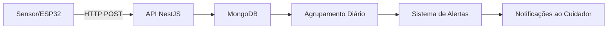

# VitalSync - Documentação da API

## 🏥 Monitoramento Inteligente do Sono para Prevenção de AVC em Idosos

Esta é a documentação da API do **VitalSync**, um sistema inovador que monitora padrões de sono e sinais vitais em pacientes idosos. Usando inteligência artificial, a API processa e armazena dados biométricos para prever riscos de AVC.

---

## 🌟 Funcionalidades

### **Funcionalidade Principal**
- Monitoramento biométrico em tempo real (frequência cardíaca, oxigênio no sangue, VFC)
- Sistema inteligente de alertas para cuidadores
- Rastreamento abrangente de dados de saúde
- Autenticação segura de usuários (JWT)

### **Destaques Técnicos**
- Endpoints RESTful bem documentados
- Validação e transformação de dados
- Resumos diários automáticos
- Geração de dados fictícios para desenvolvimento

---

## 🛠 Stack Tecnológica

### **Backend**
| Tecnologia | Finalidade |
|------------|------------|
| NestJS | Framework da API |
| MongoDB | Banco de dados NoSQL |
| Prisma | ORM para MongoDB |
| Swagger | Documentação da API |
| JWT | Autenticação |

### **Ferramentas de Desenvolvimento**
| Ferramenta | Uso |
|-----------|-----|
| class-validator | Validação de requisições |
| class-transformer | Serialização de dados |
| bcrypt | Criptografia de senhas |
| config | Gerenciamento de ambiente |

---

## 🚀 Primeiros Passos

### **Pré-requisitos**
- Node.js v16+
- MongoDB (Atlas ou local)
- Python 3.8+ (para scripts de dados fictícios)

### **Instalação**
```bash
# Clonar o repositório
git clone https://github.com/seu-usuario/Vitalsync.git
cd vitalsync/api-vitalsync

# Instalar dependências
npm install

# Configurar ambiente
cp .env.example .env
# Configure suas credenciais do banco de dados

# Gerar cliente Prisma
npx prisma generate

# Rodar em modo de desenvolvimento
npm run start:dev
```

### **Configuração do Banco de Dados**
1. Crie um cluster no MongoDB
2. Atualize a string de conexão no `.env`
3. (Opcional) Popule dados iniciais:
```bash
npx prisma db seed
```

---

## 📚 Documentação da API

Acesse a documentação interativa da API em:  
`http://localhost:3000/api` ao rodar localmente

### **Endpoints Disponíveis**

#### **Autenticação**
| Método | Endpoint | Descrição |
|--------|----------|-----------|
| POST | `/auth/signup` | Registrar novo usuário |
| POST | `/auth/login` | Login de usuário |

#### **Usuários**
| Método | Endpoint | Descrição |
|--------|----------|-----------|
| GET | `/users` | Listar todos os usuários |
| GET | `/users/:id` | Detalhes de um usuário |
| PATCH | `/users/:id` | Atualizar usuário |
| DELETE | `/users/:id` | Excluir usuário |

#### **Medições**
| Método | Endpoint | Descrição |
|--------|----------|-----------|
| POST | `/measurement` | Criar nova medição |
| GET | `/measurement` | Listar todas as medições |
| GET | `/measurement/:id` | Detalhes da medição |
| DELETE | `/measurement/:id` | Excluir medição |
| POST | `/measurement/mock` | Gerar dados fictícios |

---

## 🔌 Arquitetura do Fluxo de Dados



---

## 🧪 Testes

### **Testes Unitários**
```bash
npm run test
```

### **Testes de Integração (E2E)**
```bash
npm run test:e2e
```

### **Geração de Dados Fictícios**
```bash
# Via API
POST /measurement/mock

# Via script Python
cd scripts
python mock_measurements.py
```

---

## 📈 Deploy

### **Build de Produção**
```bash
npm run build
npm run start:prod
```

### **Variáveis de Ambiente**
| Variável | Obrigatória | Descrição |
|----------|-------------|-----------|
| DATABASE_URL | Sim | String de conexão do MongoDB |
| JWT_SECRET | Sim | Segredo para assinatura do JWT |
| PORT | Não | Porta da API (padrão: 3000) |

---

## 🤝 Contribuindo

1. Faça um fork do repositório
2. Crie uma branch de funcionalidade (`git checkout -b feature/nova-funcionalidade`)
3. Faça commit das alterações (`git commit -m 'Adicionar nova funcionalidade'`)
4. Faça push da branch (`git push origin feature/nova-funcionalidade`)
5. Abra um Pull Request

---

## 📜 Licença

Licença MIT - Veja [LICENSE](LICENSE) para mais detalhes.

---
